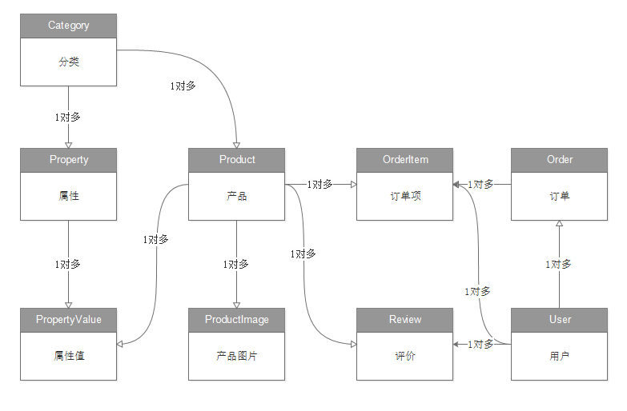

# tmall_ssm(基于SSM的仿天猫商城及后台管理系统)
#### 项目介绍

此项目是笔者我为了巩固和运用所学的SSM框架技术，在从我第一个商城项目myStoreAdmin
获得的项目重构的想法上，继而完成的另一个规模更大，功能更多，技术更高效的商城项目。
    
#### 需求分析
   需求简单理解就是要做成什么样子，这些需求都是基于模仿天猫整站整理出来的，主要分为3类。
        
    1. 前端展示:
   在前端页面上显示数据库中的数据，如首页，产品页，购物车，分类页面等等。 
   至于这些前端页面如何组织显示，页面布局，css样式设置，Javascript交互代码等，属于前端领域的知识，需要自己系统学习才能掌握。 
   我这里就不再详细说明了，需要前台html静态页面的可以加我微信：TQ201804
  
    2. 前端交互: 
   这里的前端交互，与模仿天猫前端教程里的交互，不是同一个概念。 
   模仿天猫前端教程里的交互，仅仅停留在浏览器上的javascript交互，这里的交互指的是通过POST,GET等http协议请求，与服务端进行同步或者异步数据交互。
   比如购买，购物车，生成订单，登录等等功能。 
    
    3. 后台功能 :
   对支撑整站需要用到的数据，进行管理维护。 比如分类管理，分类属性管理， 产品管理，产品图片管理，用户管理，订单管理等等。
    
#### 前后台功能清单
    
  ###### 1.前台功能：
    1 首页    
    2 分类页    
    3 查询结果页    
    4 产品页    
    5 结算页面    
    6 支付页面    
    7 支付成功页面    
    8 购物车页面    
    9 我的订单页面    
    10 确认收货页面    
    11 确认收货成功页面    
    12 进行评价页面    
    13 登录页面    
    14 注册页面    
  
  ###### 2.后台功能：
    1 分类管理    
    2 分类属性管理    
    3 产品管理    
    4 产品属性设置    
    5 产品图片管理    
    6 用户管理    
    7 订单管理 
   
   #### 涉及的技术  
    JavaSE: 
        Java基础和Java中级的大部分内容
    前端：
        HTML, CSS, JAVASCRIPT, JQUERY,AJAX, Bootstrap
    JavaEE：
        TOMCAT, SERVLET, JSP, Filter
    框架：
        Spring，Spring MVC，Mybatis，Spring+Mybatis整合，SSM整合
    数据库：
        MySQL
    开发工具:
        Intellij IDEA, Maven
        
#### 表结构设计
   在需求分析结束之后，接下来要做的不是马上开发功能，而是进行表结构的设计。 
   只有把表结构设计正确了，才能支撑软件后续的功能开发，这一步是非常重要的。 
   为了便于大家理解表结构设计的过程，把设计过程分解成了4步。 
    
   1. 数据库的创建  
   创建数据库：tmall_ssm，并且将数据库的编码设置为utf8，便于存放中文
   
    DROP DATABASE IF EXISTS tmall_ssm;
    CREATE DATABASE tmall_ssm DEFAULT CHARACTER SET utf8;
    
   2. 表与表关系   
    在下面这张表关系图上，列出了模仿天猫整站一共需要用到的9张表，以及表之间的关系。

   

    
    表名	              中文含义	                    介绍
    Category	       分类表	     存放分类信息，如女装，平板电视，沙发等
    Property	       属性表	     存放属性信息，如颜色，重量，品牌，厂商，型号等
    Product	               产品表	     存放产品信息，如LED40EC平板电视机，海尔EC6005热水器
    PropertyValue	       属性值表	     存放属性值信息，如重量是900g,颜色是粉红色
    ProductImage	      产品图片表	     存放产品图片信息，如产品页显示的5个图片
    Review	               评论表	     存放评论信息，如买回来的蜡烛很好用，么么哒
    User	               用户表	     存放用户信息，如斩手狗，千手小粉红
    Order	               订单表	     存放订单信息，包括邮寄地址，电话号码等信息
    OrderItem	       订单项表	     存放订单项信息，包括购买产品种类，数量等
    
    3. 建表SQL语句
     
    在项目resources目录下的sql目提供了所有建库建表的sql语句。
    
    
